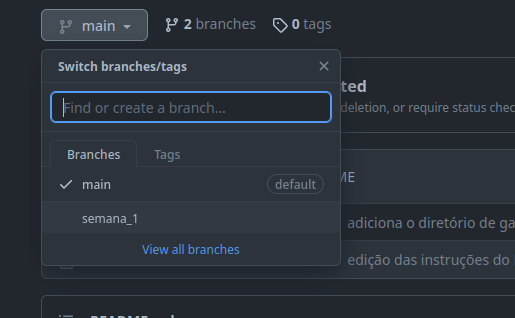

# Exercícios de fixação feitos para o curso Python Para Inovação Cívica da Escola de Dados - Open Knowledge Brasil

O repositório tem o objetivo de auxiliar na fixação dos conteúdos propostos em aula durante o curso.

Ele está dividido da seguinte forma:

- Os gabaritos dos exercícios se encontram na branch "Main"
- Os exercícios serão adicionados das branchs apropriadas conforme o conteúdo das semanas do curso:
  - Para baixar a branch da semana basta acessar a lista de branchs do repositório, selecionar
    a semana desejada e fazer o clone para seu ambiente local.

     

Para selecionar uma branch basta selecioná-la na lista de branchs e cloná-la ou fazer o fork do
repositório.

## Semana 1 - Introdução ao Python e Análise Descritiva

- [x] Estruturas de decisão simples e aninhadas

- [ ] Estruturas iteração (#TODO)

- [ ] Carregamento, leitura e escrita em arquivos para análises descritivas (#TODO)

## Semana 2 - Estatística Descritiva e pré-processamento

- [ ] #TODO
